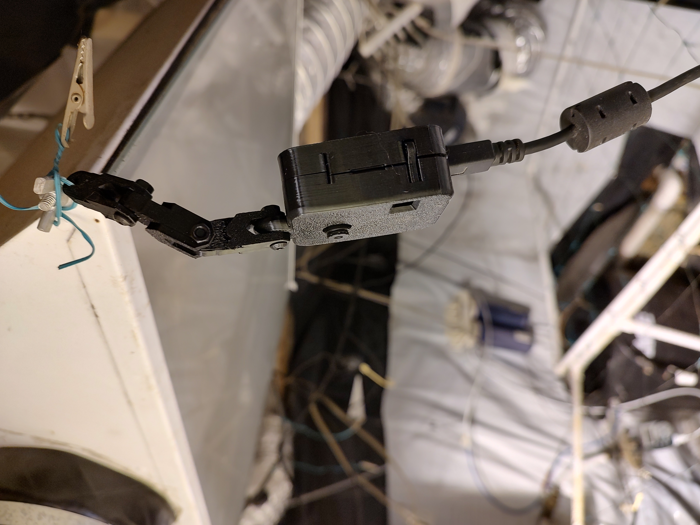
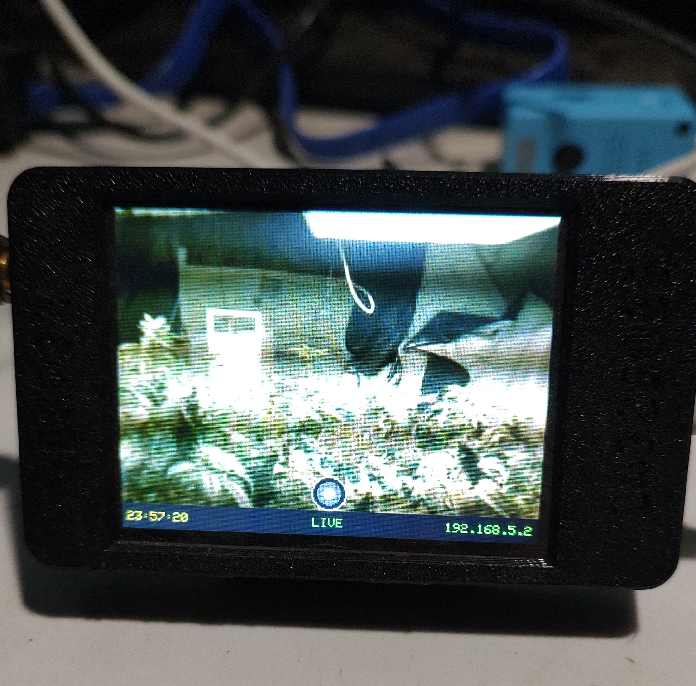

# CYD-ESP32-CAM — Wireless Camera Display

A wireless camera system using an AI Thinker ESP32-CAM as the image source and an ESP32-2432S028R (CYD) touchscreen as the display and controller.

---

## System Overview

```
┌─────────────┐  WiFi (SoftAP)  ┌──────────────────┐
│ ESP32-CAM   │────────────────▶│ CYD Display      │
│ AI Thinker  │  /latest.jpg    │ ESP32-2432S028R  │
│ OV2640      │  /status        │ ILI9341 320×240  │
└─────────────┘                 └──────────────────┘
  Captures JPEG                   Hosts WiFi AP
  on request                      Touchscreen UI
                                   Gallery (SPIFFS)
                                   SD card saves
                                   Software clock
```

The CYD creates a WiFi SoftAP (`StickVCam`). The ESP32-CAM connects to it and serves JPEG frames on demand. The CYD polls for new frames, displays them full-screen, and handles all user interaction.

---

## Hardware

| Device | Board | Role |
|---|---|---|
| Camera | AI Thinker ESP32-CAM (OV2640) | Captures and serves JPEG frames over WiFi |
| Display | ESP32-2432S028R (CYD) | WiFi AP, touchscreen display, gallery, SD card, clock |

---

## Touch Controls

| Zone | LIVE mode | GALLERY mode |
|---|---|---|
| **Centre (upper screen)** | Toggle → GALLERY | Toggle → LIVE |
| **Bottom-centre ◉** | CAPTURE (save to gallery + SD) | — |
| **Left edge** | — | Older photo |
| **Right edge** | — | Newer photo |
| **Status bar (bottom strip)** | Cycle filter | Cycle filter |

**Filters:** None → Grayscale → Invert → Sepia (applied at draw time)

---

## Status Bar

```
[HH:MM:SS]   [LIVE / filter name]   [cam IP / photo index]
```

---

## Boot Settings Menu

Hold the **centre of the screen** during the 3-second boot countdown to enter the settings menu.

**Page 1 — Set Time:** Adjust HH and MM with +/− buttons. Time is saved to NVS flash and restored on next boot (approximate — no hardware RTC).

**Pages 2–4 — Schedules 1–3:** Enable/disable each slot and set a daily HH:MM auto-capture time. When the clock reaches a scheduled time, the CYD automatically captures a frame from the ESP32-CAM and saves it to gallery + SD card.

Press **SAVE** on the last page to commit all changes.

> **Clock accuracy:** The software clock drifts slightly (~1–2 min/day). It restores from the last saved time on reboot. For precision timing, a DS3231 RTC module can be added on I2C.

---

## Gallery

The last 24 captured photos are stored in a SPIFFS ring buffer and persist across reboots. In GALLERY mode, tap the left/right screen edges to browse them.

---

## SD Card

Insert a FAT32-formatted microSD card into the CYD's SD slot. Manual captures (shutter button) and scheduled captures are saved as:

```
/photos/cap00001.jpg
/photos/cap00002.jpg
...
```

The counter persists across reboots via NVS. The live feed auto-poll does **not** write to SD — only intentional captures (manual or scheduled) do.

---

## Project Structure

```
CYD-ESP32-CAM/
├── ESP32Cam/                   ← AI Thinker ESP32-CAM PlatformIO project
│   ├── platformio.ini
│   └── src/main.cpp
│
└── ESP32Cam_CYD/               ← CYD display PlatformIO project
    ├── platformio.ini
    └── src/main.cpp
```

---

## Flash / Setup

### 1 — ESP32-CAM
```bash
cd ESP32Cam
pio run -t upload --upload-port /dev/ttyUSB0
```
> GPIO0 must be pulled LOW during boot to enter flash mode. Remove the jumper after flashing.

### 2 — CYD Display
```bash
cd ESP32Cam_CYD
pio run -t upload --upload-port /dev/ttyUSB0
```

### Boot order
1. Power the CYD first — it creates the `StickVCam` WiFi AP
2. Power the ESP32-CAM — it connects to the AP automatically
3. CYD discovers the camera within ~10 seconds and starts the live feed

---

## Photos

**ESP32-CAM mounted in greenhouse — clipped to tent frame pointing down at canopy**


**CYD display showing live feed — plants under 1000W HPS lighting**


---

## Known Issues

### Clock resets on power loss
Without a hardware RTC, the clock is restored from the last NVS-saved time (saved every minute). If the board was off for a long time the time will be off. Reset it via the boot settings menu.
